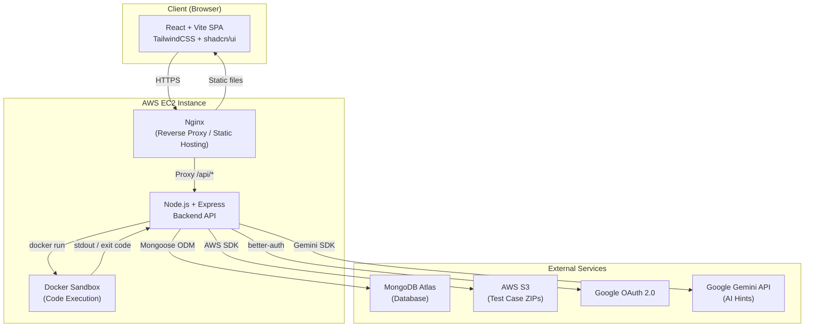
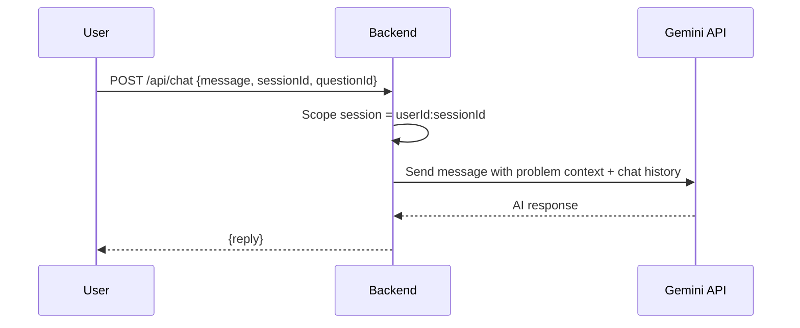
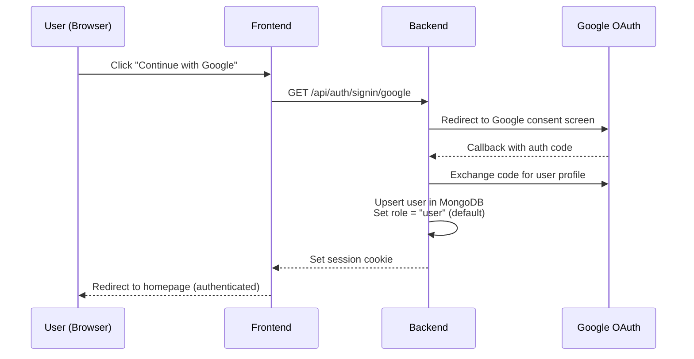
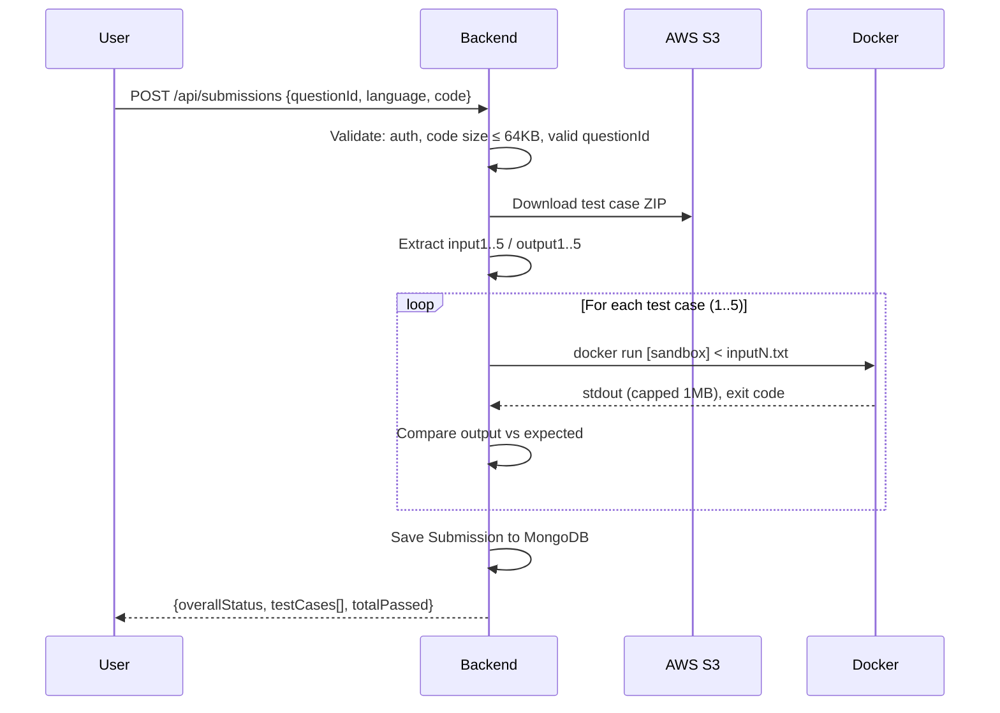
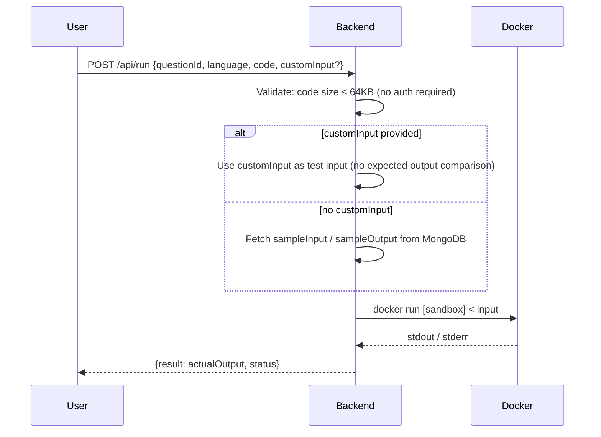
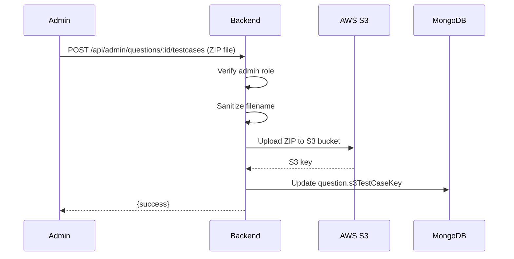
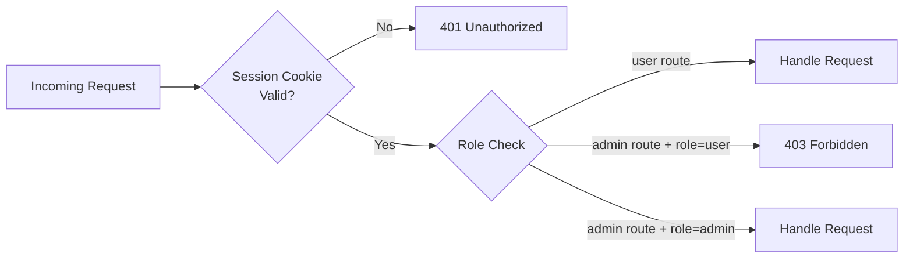
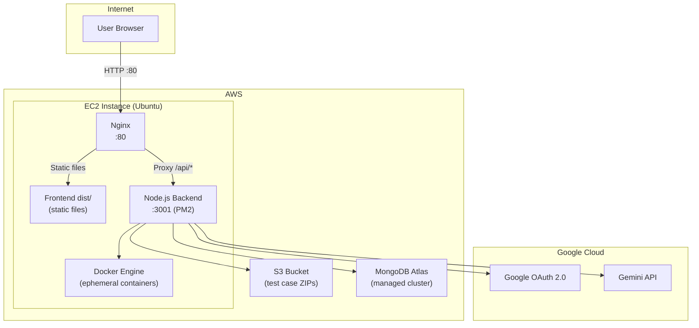

# High-Level Design (HLD) — AlgoUniversity Online Judge

**Version:** 1.0  
**Last Updated:** May 2026  
**Author:** Anurag Daliya

---

## Table of Contents

1. [System Overview](#1-system-overview)
2. [Architecture Diagram](#2-architecture-diagram)
3. [Component Breakdown](#3-component-breakdown)
4. [Request Flow Diagrams](#4-request-flow-diagrams)
5. [API Overview](#5-api-overview)
6. [Security Architecture](#6-security-architecture)
7. [Infrastructure & Deployment](#7-infrastructure--deployment)
8. [Technology Stack](#8-technology-stack)
9. [Known Limitations & Future Scope](#9-known-limitations--future-scope)

---

## 1. System Overview

AlgoUniversity OJ is a full-stack **Online Judge (OJ)** platform that allows users to solve programming problems, run code against sample inputs, and submit solutions for evaluation against hidden test cases. Administrators can manage problems and upload test cases via a dedicated dashboard.

### Core Capabilities

| Capability | Description |
|---|---|
| Problem Browsing | Users browse and filter DSA problems by difficulty and tags |
| Code Execution | Run code (C++, Java, Python) against a sample test case in real time |
| Custom Test Case | Run code against any user-supplied input without signing in |
| Submission Judging | Submit code for evaluation against all hidden test cases |
| Admin Dashboard | Admins create problems and upload test case ZIPs |
| AI Hints | Per-problem AI chat assistant powered by Gemini |
| Authentication | Google OAuth 2.0 with role-based access control (admin / user) |

---

## 2. Architecture Diagram



---

## 3. Component Breakdown

### 3.1 Frontend

| Item | Detail |
|---|---|
| Framework | React 18 + Vite + TypeScript |
| Styling | TailwindCSS + shadcn/ui component library |
| Auth Client | better-auth client SDK |
| Code Editor | Monaco Editor (VS Code engine) |
| Markdown | react-markdown + remark-gfm |
| State | React local state (no global store) |
| Build Output | Static `dist/` served by Nginx |

**Key Pages**

| Route | Page | Access |
|---|---|---|
| `/` | Problems list | Public |
| `/problems/:id` | Problem detail + editor | Public (submit requires auth) |
| `/signin` | Google OAuth sign-in | Public |
| `/admin` | Admin dashboard | Admin only |
| `/admin/questions` | Question management | Admin only |

---

### 3.2 Backend

| Item | Detail |
|---|---|
| Runtime | Node.js 20 + TypeScript (tsx) |
| Framework | Express.js |
| Auth | better-auth (Google OAuth + RBAC) |
| DB ORM | Mongoose (app models) + native MongoClient (better-auth adapter) |
| Rate Limiting | express-rate-limit |

**Route Groups**

| Prefix | Purpose | Auth Required |
|---|---|---|
| `/api/auth/*` | OAuth sign-in / session management | No |
| `/api/questions` | Browse & search problems | No |
| `/api/run` | Run code against sample or custom input | No |
| `/api/submissions` | Submit code + fetch history | Yes (user) |
| `/api/chat` | AI hint chat per problem | Yes (user) |
| `/api/admin` | Create / delete questions, upload ZIPs | Yes (admin) |
| `/api/user` | User profile info | Yes (user) |

---

### 3.3 Code Execution Engine

Each code submission spins up an **ephemeral Docker container** with strict resource constraints:

```
docker run --rm -i
  --memory=256m
  --cpus=1
  --pids-limit=50
  --network=none
  <image>
```

| Language | Docker Image | Compile Step |
|---|---|---|
| C++ | `gcc:latest` | `g++ -O2 -o /tmp/sol /tmp/sol.cpp` |
| Java | `openjdk:21-slim` | `javac /tmp/Main.java` |
| Python | `python:3.11-slim` | None (interpreted) |

**Safeguards**

| Threat | Mitigation |
|---|---|
| Infinite loop | 5-second execution timeout |
| Memory bomb | `--memory=256m` hard limit |
| Fork bomb | `--pids-limit=50` |
| Network access | `--network=none` |
| Large output | 1 MB stdout cap (backend-enforced) |
| Large code | 64 KB code size limit (backend-enforced) |

---

### 3.4 Test Case Storage

Test cases are stored as **flat ZIP files** in AWS S3. Each ZIP contains:

```
input1.txt  input2.txt  ... input5.txt
output1.txt output2.txt ... output5.txt
```

At judge time, the backend downloads and extracts the ZIP, runs the user's code against each input, and compares the output to the expected output (trimmed).

---

### 3.5 AI Hint Service



- Chat history is maintained **in-memory per scoped session** (`userId:sessionId`)
- Sessions are isolated per user — no cross-user history access
- Message length capped at 2,000 characters

---

## 4. Request Flow Diagrams

### 4.1 Authentication Flow (Google OAuth)



---

### 4.2 Code Submission Flow



---

### 4.3 Sample Run / Custom Test Case Flow



---

### 4.4 Admin — Upload Test Cases



---

## 5. API Overview

### Public Endpoints

| Method | Route | Description |
|---|---|---|
| GET | `/api/health` | Health check |
| GET | `/api/questions` | List questions (filter by difficulty, tag, search) |
| GET | `/api/questions/:id` | Get single question |
| POST | `/api/run` | Run code against sample input or a custom input (`customInput?`) |

### Authenticated Endpoints (User)

| Method | Route | Description |
|---|---|---|
| POST | `/api/submissions` | Submit code for judging |
| GET | `/api/submissions?questionId=` | Get my submissions for a problem |
| GET | `/api/user/me` | Get current user profile |
| POST | `/api/chat` | Send AI hint message |

### Authenticated Endpoints (Admin)

| Method | Route | Description |
|---|---|---|
| POST | `/api/admin/questions` | Create a new question |
| DELETE | `/api/admin/questions/:id` | Delete a question |
| POST | `/api/admin/questions/:id/testcases` | Upload test case ZIP to S3 |
| GET | `/api/admin/users` | List all users |
| PATCH | `/api/admin/users/:id/role` | Promote / demote user role |

---

## 6. Security Architecture

### Authentication & Authorization



### Security Controls Summary

| Layer | Control |
|---|---|
| Auth | HTTP-only session cookie via better-auth |
| RBAC | `requireAuth` + `requireRole("admin")` middleware |
| Rate Limiting | 200 req/15 min (general), 30 req/5 min (execute) |
| Input Validation | Code size ≤ 64KB, message ≤ 2000 chars, ObjectId checks |
| ReDoS Prevention | `escapeRegex()` on all search queries |
| Query Safety | `.limit(200)` on all list queries |
| Code Execution | Docker isolation: no network, memory cap, pids cap, timeout |
| Output Safety | 1 MB stdout cap to prevent memory exhaustion |
| File Upload | S3 filename sanitized — only `[a-zA-Z0-9._-]` allowed |
| Secrets | All credentials in `.env`, never committed to git |
| CORS | Scoped to `FRONTEND_URL` only |

---

## 7. Infrastructure & Deployment



### Deployment Steps (Production)

```
1. git pull origin main
2. cd frontend && npm install && npm run build
3. sudo cp -r frontend/dist/* /path/to/nginx/root/
4. cd backend && npm install
5. pm2 restart all
6. sudo systemctl reload nginx
```

---

## 8. Technology Stack

| Category | Technology |
|---|---|
| Frontend | React 18, Vite, TypeScript, TailwindCSS, shadcn/ui |
| Code Editor | Monaco Editor |
| Markdown | react-markdown, remark-gfm, @tailwindcss/typography |
| Backend | Node.js 20, Express.js, TypeScript |
| Auth | better-auth (Google OAuth 2.0, RBAC) |
| Database | MongoDB Atlas (Mongoose + native MongoClient) |
| Code Execution | Docker (gcc, openjdk, python images) |
| File Storage | AWS S3 |
| AI | Google Gemini API |
| Rate Limiting | express-rate-limit |
| Reverse Proxy | Nginx |
| Process Manager | PM2 |
| Cloud | AWS EC2 (Ubuntu) |

---

## 9. Known Limitations & Future Scope

### Current Limitations

| Area | Limitation |
|---|---|
| Code Execution | Sequential per request — no execution queue |
| Chat History | In-memory only — lost on server restart |
| Test Cases | Fixed at 5 per problem |
| Languages | Only C++, Java, Python supported |
| Scalability | Single EC2 instance — no horizontal scaling |

### Future Scope

| Feature | Description |
|---|---|
| Execution Queue | Redis + Bull queue for concurrent submissions |
| Persistent Chat | Store chat history in MongoDB |
| Leaderboard | Global and per-problem rankings |
| Contests | Timed competitive programming contests |
| More Languages | Go, Rust, JavaScript support |
| Auto-scaling | Load balancer + multiple EC2 instances |
| CI/CD | GitHub Actions for automated deploy on merge |
